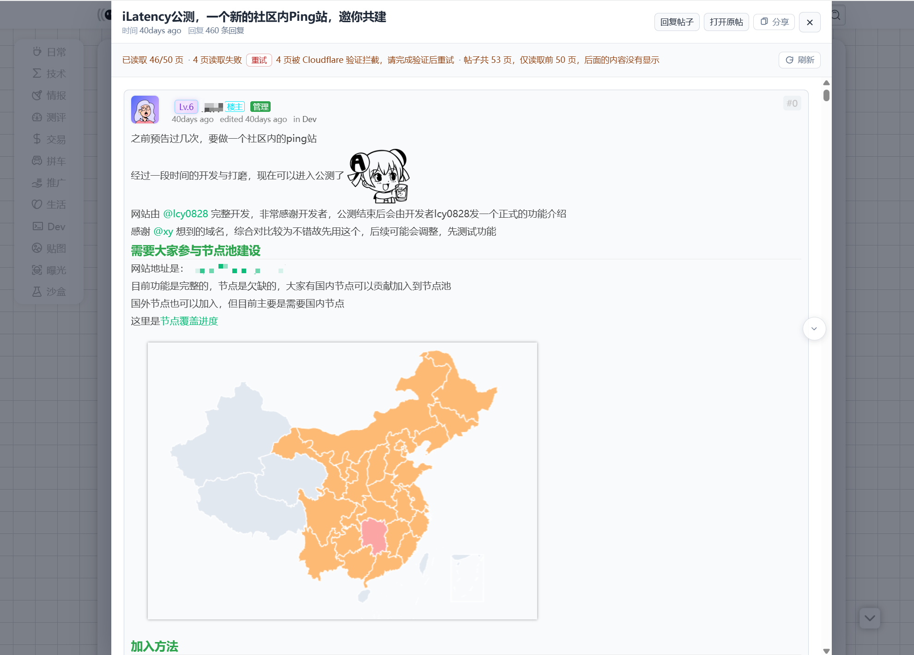
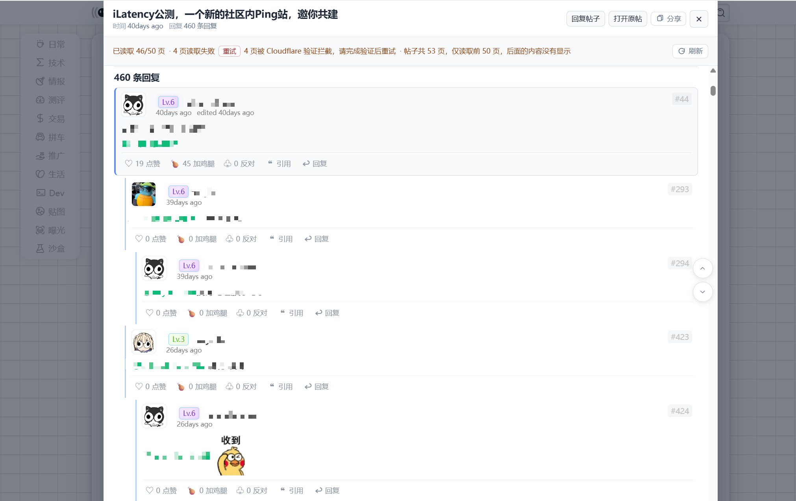
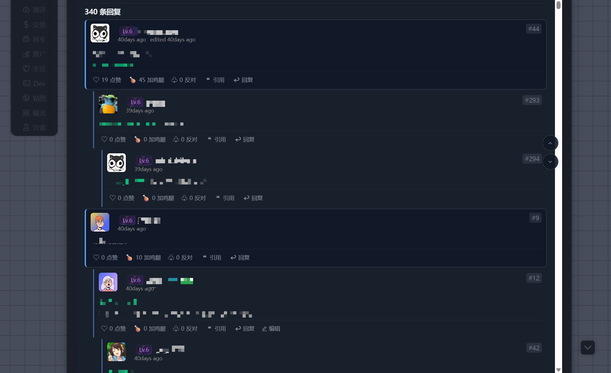

# NodeSeek 楼中楼预览

[NodeSeek](https://www.nodeseek.com) 用户脚本：把平铺评论重建成楼中楼嵌套视图。功能参考 [V2Next](https://github.com/zyronon/V2Next)。

## 功能

- 列表页点击帖子标题打开站内预览，评论按楼中楼关系展示。
- 帖子页支持楼中楼和原版评论布局切换，自动读取同帖分页并渐进显示。
- 通过虚拟楼层流限制活动 DOM，长帖仍可读取最多 50 页而不把全部富内容常驻页面。
- 支持回复、引用、编辑、点赞、鸡腿、反对、收藏、图片灯箱、代码复制、标签页、ANSI 和投票面板。
- 预览保留 NodeSeek 官方页面的头像、等级、正文和评论操作样式，并适配暗色模式。

## 效果预览

### 预览弹窗

### 楼中楼评论树

### 帖子页亮色模式

### 暗色模式

## 安装

1. 安装 Tampermonkey 或 Violentmonkey。
2. 推荐从 [Greasy Fork 安装脚本](https://greasyfork.org/zh-CN/scripts/593732)；它会负责版本更新。
3. 也可以直接安装仓库中的 [构建产物](outputs/nodeseek-comment-preview.user.js)。
4. 刷新 NodeSeek 页面。

设置从油猴脚本菜单打开，不加载远程模块，也不执行远程代码。

[GitHub 源码与问题反馈](https://github.com/moxuun/nodeseek-comment-preview) · [Greasy Fork 安装](https://greasyfork.org/zh-CN/scripts/593732)

## 限制

- 最多自动读取帖子前 50 页评论。
- Stardust 收款码不显示，这是有意限制。
- Cloudflare、网络或登录状态可能导致部分分页读取失败。
- 内容含邮箱时可能触发 NodeSeek 的 email protect。

完整使用说明见 [outputs/README.md](outputs/README.md)；源码分层、构建方式和架构图见 [src/README.md](src/README.md)。

本项目采用 [MIT License](LICENSE)。
