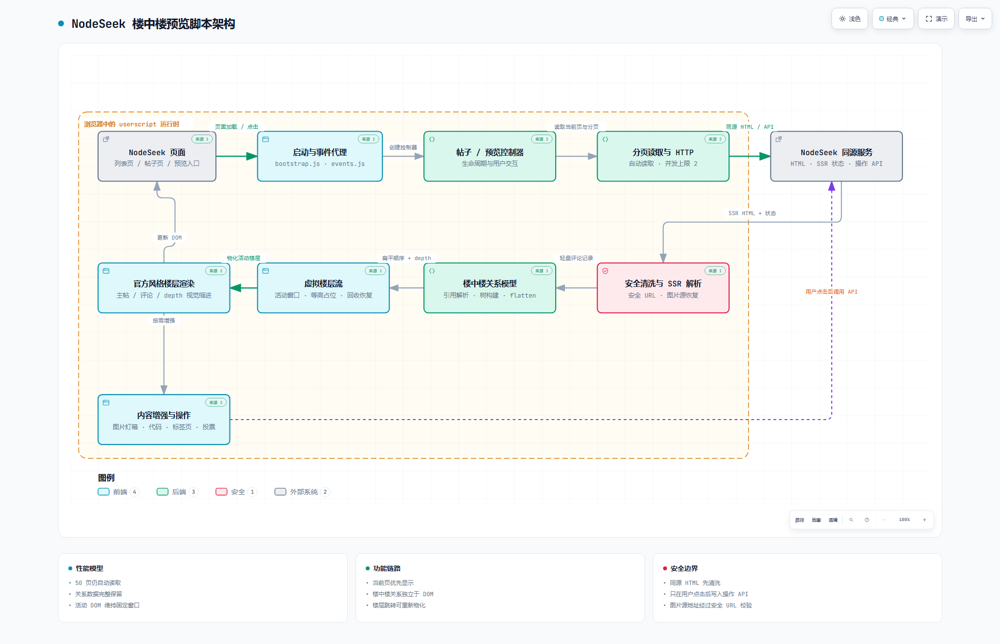

# NodeSeek 楼中楼预览

[NodeSeek](https://www.nodeseek.com)用户脚本：把平铺评论重建成楼中楼嵌套视图。功能参考 [V2Next](https://github.com/zyronon/V2Next)。

## 安装

1. 浏览器安装 Tampermonkey 或 Violentmonkey 扩展
2. 打开 [outputs/nodeseek-comment-preview.user.js](outputs/nodeseek-comment-preview.user.js) 并安装
3. 刷新 NodeSeek 页面即可生效

脚本只使用 `GM_registerMenuCommand` 注册油猴菜单中的“打开设置”入口，不加载远程模块，不执行远程代码。安装后可在 Tampermonkey/Violentmonkey 的脚本菜单中打开设置。

## 功能

1. **预览楼中楼**：首页/列表页点击帖子标题打开站内预览，回复按楼中楼嵌套展示；压缩信息密度，复杂论战一分钟吃完瓜。
2. **图片灯箱**：预览图片点击放大、滚轮缩放、拖动、Esc 关闭，可打开原图。
3. **Markdown / NQ 渲染**：沿用 NodeSeek 服务端渲染的 Markdown 结构、ANSI 代码块、标签页；`pre > code` 代码块带一键复制。
4. **虚拟楼层流**：多分页仍自动读取，但只把视口附近的评论物化成 DOM；远处使用等高占位，首屏先出当前页。

源码按功能拆分，构建产物位于 `outputs/`：

| 目录 | 职责 |
| --- | --- |
| `src/core/` | 运行时常量与状态 |
| `src/nodeseek/` | NodeSeek URL、DOM/SSR 适配、身份和动作 API |
| `src/data/` | 分页读取与评论记录收集 |
| `src/preview/` | 预览入口、弹窗、滚动、灯箱、楼层导航、渲染和虚拟楼层流 |
| `src/comments/` | 评论树模型 |
| `src/features/` | 评论动作、内容增强、投票 |
| `src/post-page/` | 原帖页增强控制器 |
| `src/app/`、`src/ui/` | 启动事件和样式 |

完整使用说明、故障排查与版本历史见 [outputs/README.md](outputs/README.md)。

## 架构图

项目的模块划分、数据流和安全边界见下图。README 使用白色调静态预览；点击图片可打开交互式架构图。

架构图源规格见 [nodeseek-architecture.architecture.json](nodeseek-architecture.architecture.json)。

## 已知问题

- Stardust 收款码不会显示（有意不支持）。
- 本地夹具回归覆盖结构和交互；真实环境只读冒烟需要连接已打开的浏览器标签，不能替代真实账号下的写操作验证。
- 内容含邮箱时会触发 NodeSeek 的 email protect。
- 只能读取帖子前 50 页评论。

## 文件结构

| 路径 | 说明 |
| --- | --- |
| `outputs/nodeseek-comment-preview.user.js` | 用户脚本构建产物（安装这个） |
| `work/build.mjs` | 将源码模块构建为用户脚本 |
| `outputs/README.md` | 完整中文文档 |
| `work/test/` | 浏览器端到端回归测试（`npm install && npm test`）；真实环境只读冒烟见 [`work/test/README.md`](work/test/README.md) |
| `work/xns-fixture-server.mjs` | 本地 fixture HTTP 服务器（测试用） |
| `work/xns-fixture/` | 测试用帖子/列表页面 |
