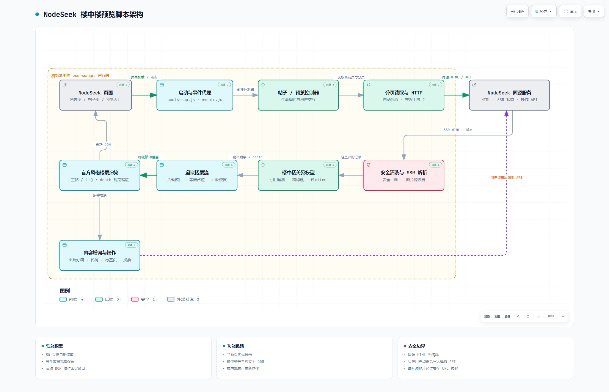

# 源码说明

源码按功能拆分，使用显式 ES 模块依赖，由 Vite + vite-plugin-monkey 构建到 `outputs/`。
`src/main.ts` 是唯一脚本入口，`vite.config.ts` 管理 userscript 元数据，版本读取根目录 `package.json`。
设置面板由 `src/ui/settings-panel.tsx` 使用 React + TypeScript 渲染，关闭时卸载 React root。
`src/ui/settings.js` 仅桥接现有状态、偏好保存和油猴菜单；React 不接管 NodeSeek 原生评论节点。
`src/nodeseek/sanitize.ts` 使用 DOMPurify 清洗远端节点，再应用楼层 ID、评论菜单、链接和延迟图片规则；不清洗或替换当前页原生评论节点。
其余业务模块仍为 JS，虚拟列表库将单独迁移。

| 目录职责 | 说明 |
| --- | --- |
| `src/core/` | 运行时常量与状态 |
| `src/nodeseek/` | NodeSeek URL、DOM/SSR 适配、身份和动作 API |
| `src/data/` | 分页读取与评论记录收集 |
| `src/preview/` | 预览入口、弹窗、滚动、灯箱、楼层导航、渲染和虚拟楼层流 |
| `src/comments/` | 评论树模型 |
| `src/features/` | 评论动作、内容增强、投票 |
| `src/post-page/` | 原帖页增强控制器 |
| `src/app/`、`src/ui/` | 启动事件和样式 |

## 构建

在仓库根目录运行：

```powershell
npm ci
npm run build
```

需要 Node.js 22.12+（22.x）或 24+，CI 使用 Node.js 24。
`node work/build.mjs` 仍兼容旧命令，内部执行 TypeScript 检查、Vite 构建和 Greasy Fork 描述同步，不再拼接源码。
`npm run typecheck` 检查 TS 文件（现有 JS 暂不做类型检查）；`npm run dev` 启动本地 Vite 开发服务，按终端提示安装开发脚本。
发布产物是单个可读的 `.user.js`，依赖内联，不增加远程 `@require`。

安装和发布使用 `outputs/nodeseek-comment-preview.user.js`，不要直接编辑构建产物。

## 架构图

架构图展示模块划分、数据流和安全边界。点击白色调静态预览可打开交互式版本：

[](https://htmlpreview.github.io/?https://github.com/moxuun/nodeseek-comment-preview/blob/master/docs/architecture/nodeseek-architecture.html)

- [架构图源文件](../docs/architecture/nodeseek-architecture.html)
- [架构图源规格](../docs/architecture/nodeseek-architecture.architecture.json)

## 测试与真实环境检查

本地浏览器回归测试位于 `work/test/`，真实环境只读冒烟需要用户明确提供已打开 NodeSeek 的 Chrome CDP 地址。夹具通过本地页面模拟 NodeSeek，只能验证已定义的模拟契约，不能替代真实页面兼容性检查。

- [完整使用说明](../outputs/README.md)
- [测试说明](../work/test/README.md)
